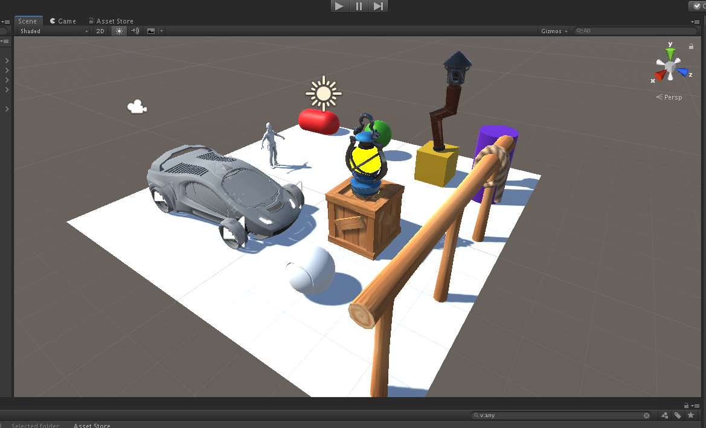

# Proyecto básico en Unity
## Tarea inicial de FDV:
### Crear un proyecto Unity 3D que cumpla los siguientes requisitos:

### Incluir objetos 3D con diferentes materiales.
### Incluir alguno de los GameObjects de los Standard Assets: Automóvil, Ethan, Pelota de béisbol
### Incluir algún asset de la Asset Store en la cuenta del máster.

